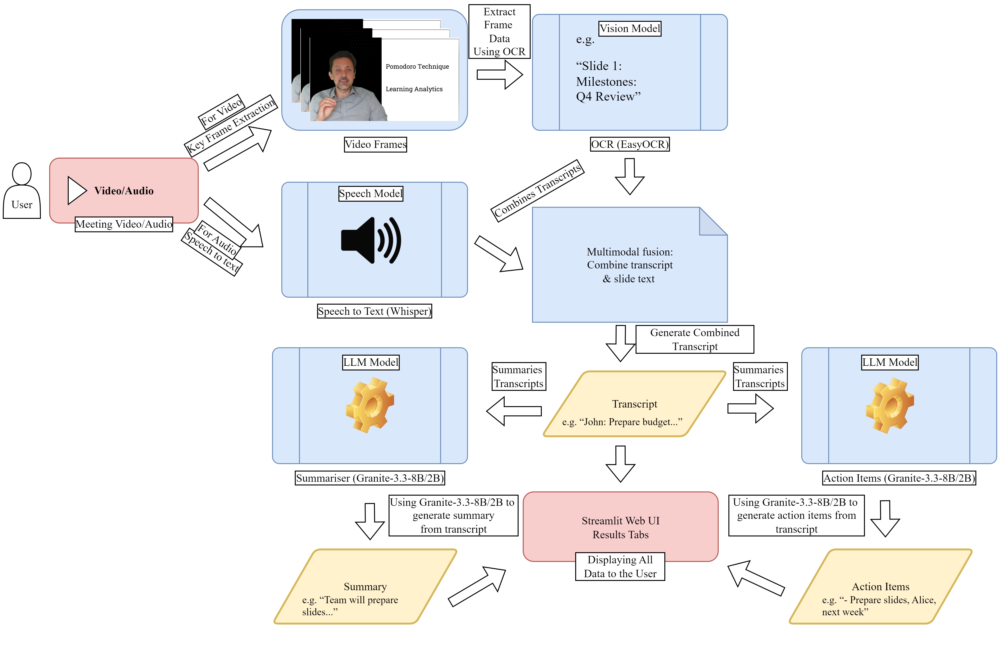

# Multimodal Meeting & Video Summariser

> Local, privacy-first pipeline that turns meeting **audio/video** into a clean **summary** and **action items**, with optional **slide OCR** for presentation videos.

[](https://www.python.org/)
[](https://streamlit.io/)
[](./LICENSE)

---

## Table of Contents

- [Highlights](#highlights)
- [System Overview](#system-overview)
- [Requirements](#requirements)
- [Install](#install)
  - [Windows (one-click)](#windows-one-click)
  - [macOS / Linux](#macos--linux)
- [Run](#run)
  - [Streamlit UI](#streamlit-ui)
  - [CLI (batch)](#cli-batch)
- [Configuration](#configuration)
- [Project Structure](#project-structure)
- [Outputs](#outputs)
- [Performance Tips](#performance-tips)
- [Troubleshooting](#troubleshooting)
- [Privacy & Ethics](#privacy--ethics)
- [License](#license)
- [Credits](#credits)

---

## Highlights

- **Audio + Video input:** `.wav .mp3 .m4a .mp4 .mov .mkv .avi .flv .webm`
- **ASR (speech-to-text):** Faster-Whisper (CUDA if available; CPU fallback)
- **Slide OCR (video):** EasyOCR + perceptual-hash frame de-duplication
- **Multimodal summarisation:** transcript + slide text summarised by local LLM **IBM Granite-3.3 (8B/2B)**
- **Action items extraction:** numbered tasks with optional **Owner** and **Deadline**
- **Streamlit UI:** upload → process → preview → download
- **Per-run artifacts:** each run saved under `outputs/<run_id>/` (prevents clobbering)
- **Deterministic output:** strict post-processing prevents duplicate headings or “Revised Response”
- **Graceful empties:** if there’s nothing to summarise/extract, we write the literal `none`
- **Privacy-first:** all processing is local—no cloud calls

---

## System Overview



Flow: Upload → **ASR (Whisper/Faster-Whisper)** → *(video only)* **OCR (EasyOCR)** → Combine → **Summarise (Granite)** → **Extract Actions** → Downloads.

---

## Requirements

- Python **3.10+**
- `ffmpeg` on PATH (audio extraction)
- Optional: NVIDIA GPU + recent CUDA for best performance

> If you need a specific PyTorch build for your GPU/CUDA, install it first using the official PyTorch instructions, then install the rest of the dependencies.

---

## Install

### Windows (one-click)

1. **Double-click** `run_app.bat`  
   - Runs `tools\install_torch.py` to install a compatible PyTorch wheel (CUDA if available, else CPU).
   - Installs Python dependencies.
   - Launches the Streamlit UI.

> If the console shows a Torch warning, close the window and run `run_app.bat` again (it is idempotent).

### macOS / Linux

```bash
# optional: create a virtual environment
python -m venv .venv
# macOS/Linux:
source .venv/bin/activate
# Windows (PowerShell):
# .venv\Scripts\Activate.ps1

pip install -r requirements.txt
````

---

## Run

### Streamlit UI

```bash
streamlit run app/app.py
```

1. Upload an audio or video file.
2. Click **Process file**.
3. Explore tabs for **Slides (OCR)**, **Transcript**, **Combined**, **Summary**, and **Action Items**.
4. Use **Download** buttons to save results.

### CLI (batch)

```bash
python core/pipeline.py \
  --media data/samples/input.mp4 \
  --outdir outputs/2025-09-16-demo \
  --interval 5 --lang en [--cpu]
```

All step outputs are written into the chosen `--outdir`.

---

## Configuration

Environment variables (optional, advanced):

| Variable                 | Default  | Description                                       |
| ------------------------ | -------- | ------------------------------------------------- |
| `FYP_QUANT`              | `4bit`   | Model quant: `4bit` \| `8bit` \| `fp16` \| `auto` |
| `FYP_REPETITION_PENALTY` | `1.15`   | Penalise repetition in generation                 |
| `FYP_NO_REPEAT_NGRAM`    | `8`      | N-gram blocking size                              |
| `FYP_MODEL_ID`           | *(auto)* | Override Hugging Face model id                    |
| `FYP_FORCE_MODEL`        | *(auto)* | Force family: `8b` \| `2b`                        |
| `FYP_MAX_INPUT_TOKENS`   | `2048`   | Chunk size (input tokens)                         |
| `FYP_OVERLAP_TOKENS`     | `256`    | Overlap between chunks                            |
| `FYP_BATCH`              | `2`      | Generation batch size                             |

Increase Streamlit upload limit via `.streamlit/config.toml`:

```toml
[server]
maxUploadSize = 1024  # MB
```

---

## Project Structure

```text
project-root/
├─ app/
│  └─ app.py                    # Streamlit frontend (per-run snapshots; partial re-runs)
├─ core/
│  ├─ transcribe.py             # ASR (Faster-Whisper)
│  ├─ video_ocr.py              # Slide OCR (EasyOCR + hash de-dup)
│  ├─ summarise.py              # LLM summary (Granite-3.3 8B/2B)
│  ├─ extract_actions.py        # Action item extraction (Granite-3.3)
│  └─ pipeline.py               # CLI orchestrator
├─ tools/
│  └─ install_torch.py          # Chooses CUDA/CPU Torch build and installs it
├─ outputs/                     # Per-run artifacts (auto-created)
├─ data/
│  ├─ samples/                  # Uploaded inputs (UI snapshot)
│  └─ frames/                   # Extracted frames for OCR
├─ offload_cache/               # HF/accelerate offload dir
├─ requirements.txt
├─ run_app.bat                  # Windows launcher
└─ .streamlit/config.toml
```

---

## Outputs

Each run is snapshotted under `outputs/<run_id>/`:

- `transcript.txt` – timestamped ASR transcript
- `slide_texts.txt` – OCR’d slide text *(video only)*
- `combined_transcript.txt` – transcript + slides
- `summary.txt` – canonical markdown summary (**`none`** if no content)
- `action_items.txt` – numbered items (**`none`** if nothing actionable)
- `params.json` – run parameters (UI)

> The UI also mirrors “fixed” files under `outputs/` for backward compatibility, then copies them into the run folder.

---

## Performance Tips

- **GPU strongly recommended** for Granite-8B; Granite-2B works on low VRAM or CPU (slower).
- Keep `FYP_QUANT=4bit` (default) for best VRAM efficiency; try `8bit` if quality dips.
- OCR is the heaviest stage on long videos—raise frame interval (e.g., `5 → 8` seconds) to speed it up.

---

## Troubleshooting

- **Torch/CUDA**
  If `run_app.bat` installs CPU wheels on a GPU machine, check:

  - `nvidia-smi` works (driver OK).
  - Your PyTorch build matches CUDA. Re-run `run_app.bat` to reattempt install.

- **ffmpeg not found**
  Install ffmpeg and ensure it’s on PATH.

- **Large uploads blocked**
  Increase `maxUploadSize` in `.streamlit/config.toml`.

- **Empty outputs (`none`)**
  If the combined transcript is empty or uninformative, `summary.txt` and/or `action_items.txt` will contain `none`.

---

## Privacy & Ethics

- **No cloud calls**: all computation is local.
- **Licensing**: check licenses for IBM Granite models and other dependencies.
- **Compliance**: only process media you are authorised to use.

---

## License

This project is licensed under the [MIT License](./LICENSE).

---

## Credits

- **Whisper / Faster-Whisper**, **Transformers**, **EasyOCR**, **imagehash**, **OpenCV**
- **IBM Granite-3.3-8B/2B Instruct** (local via Hugging Face)

---
